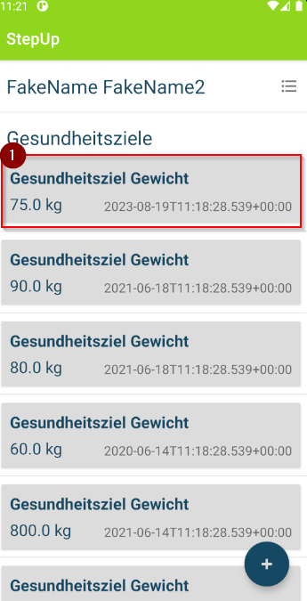
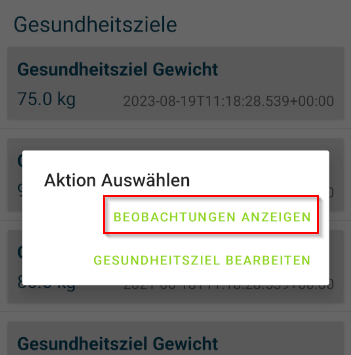
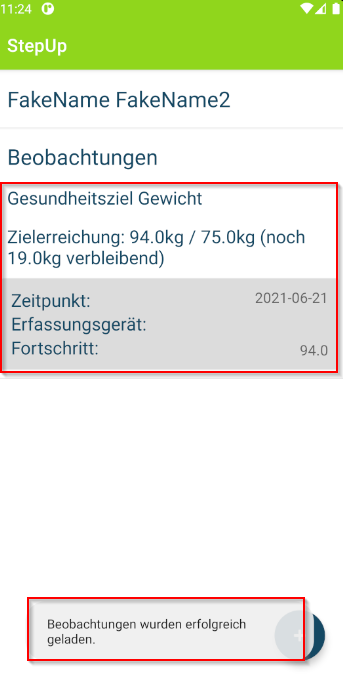

## Beobachtungen anzeigen

1. In der Übersicht der Gesundheitsziele, dass gewünschte Ziel, zu ddem die Beobachtungen angeziegt werden sollen, auswählen und anklicken

2. Die Aktion "BEOBACHTUNGEN ANZEIGEN" auswählen

3. Sobald die Beobachtunge erfolgreich angezeigt wird, erscheint eine Erfolgsmeldung. Es werden nun die Beobachtungen zu dem Gesundheitsziel angezeit.

