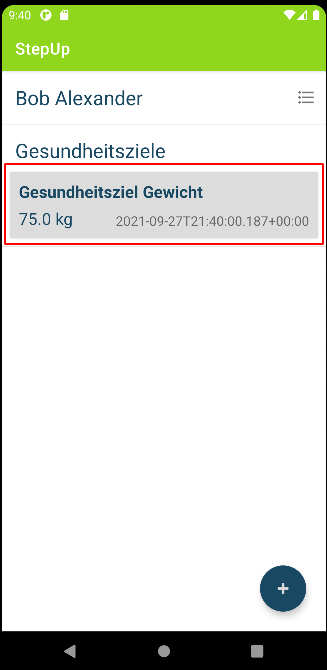
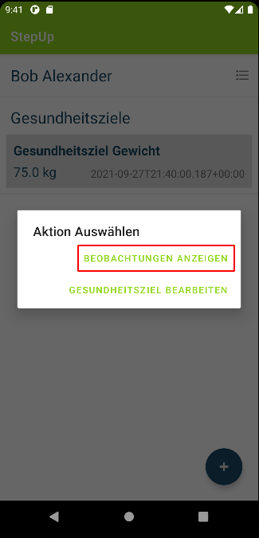
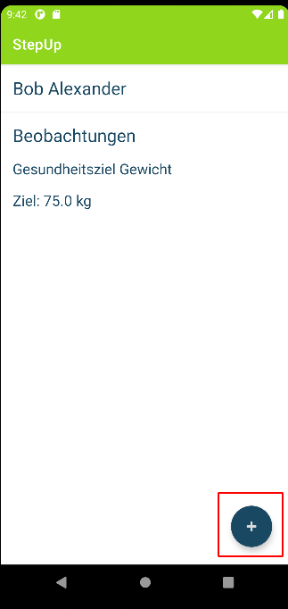

## Beobachtungen erfassen

1. Um eine Beobachtung zu erfassen, muss zuvor über das Hauptmenü das entsprechende Gesundheitsziel ausgewählt werden

2. Im Auswahlmenü "Beobachtungen anzeigen" drücken

3. Im Beobachtungsmenü den Floating Button (Plus-Symbol) drücken

4. Den erreichten Wert der Beobachtung (1), das Gerät (2) und das Datum (3), an dem die Beobachtung durchgeführt wurde, eintragen und anschließend auf "Speichern" (4) drücken

5. Warten bis eine Erfolgsmeldung/Fehlermeldung erscheint

