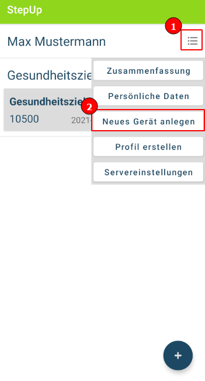
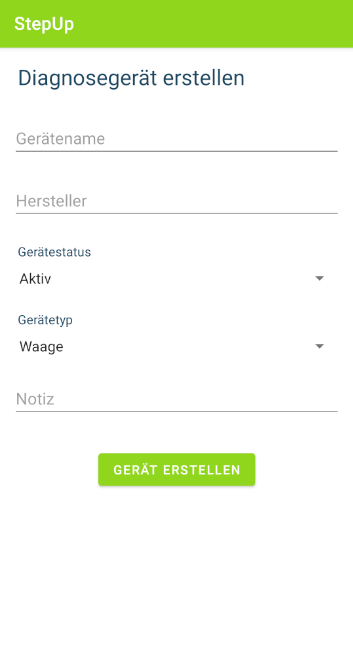
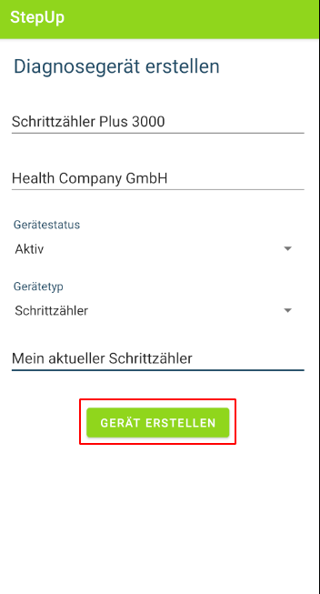

## Gerät erstellen

1. Öffnen Sie das Menü im Hauptmenü und klicken Sie auf "Neues Gerät anlegen"

2. Füllen Sie die Eingabefelder aus

3. Nachdem Sie alle Felder ausgefüllt haben, klicken Sie auf "Gerät erstellen"

4. Nachem das Gerät erfolgreich erstellt wurde, wird eine Erfolgsmeldung angezeigt

