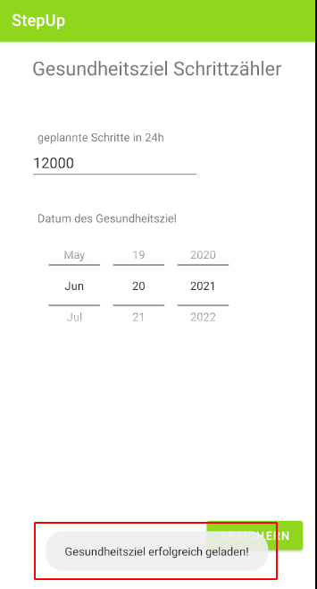
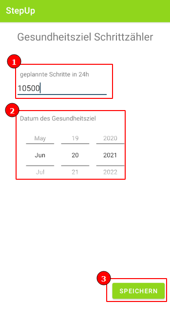
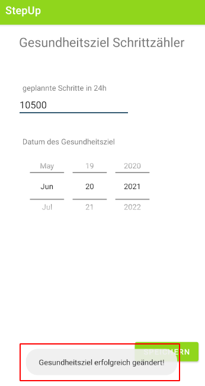

## Gesundheitsziele ändern

1. Klicken Sie im Hauptmenü auf das Gesundheitsziel, welches Sie ändern möchten

2. Klicken Sie auf "Gesundheitsziel bearbeiten"

3. Warten Sie bis das Gesundheitsziel geladen wurde

4. Nachdem Sie das Gesundheitsziel bearbeitet haben, klicken Sie auf "Speichern"

5. Warten Sie bis eine Erfolgsmeldung erscheint

6. Wenn Sie nun in das Hauptmenü zurückkehren, sollte das Gesundheitsziel geändert sein

