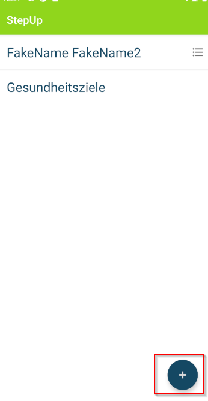
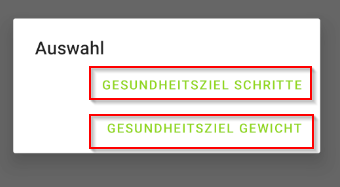
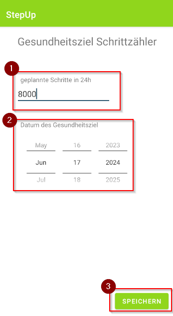
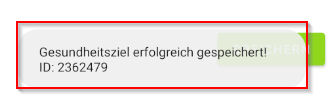

## Gesundheitsziele erstellen

1. Im Haupmenü die Floating-Button ("Plus"-Symbol) drücken

2. Im Auswahlmenü das gewünschte Gesundheitsziel auswählen

3. Das gewünschte Ziel ausfüllen. Das Datum, wann das Ziel erreicht werden soll, ausfüllen. Anschließend auf "Speichern" drücken

4. Warten bis eine Erfolgsmeldung/Fehlermeldung erscheint

