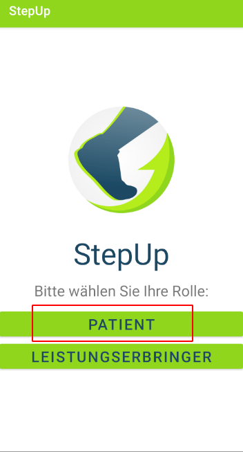
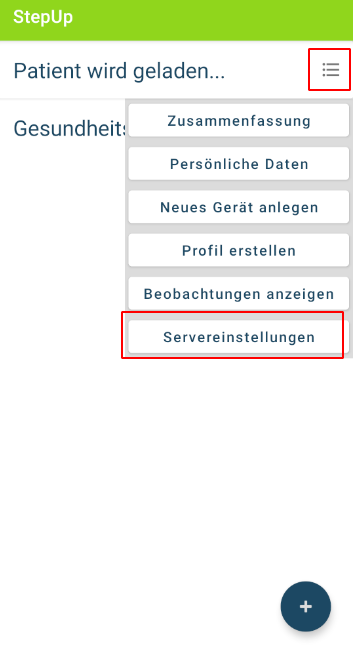
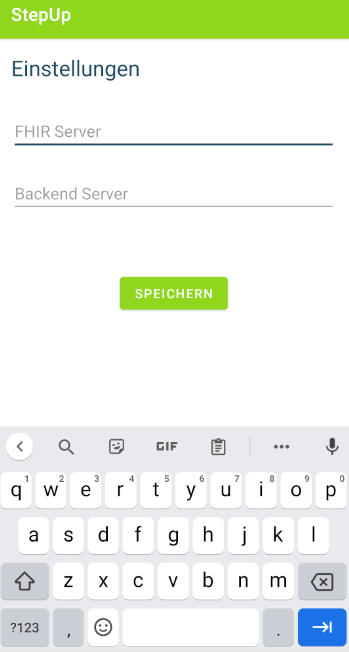
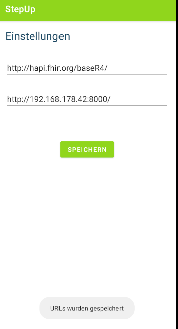
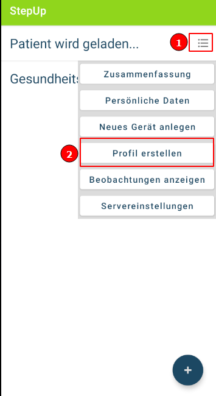
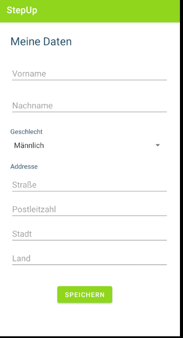
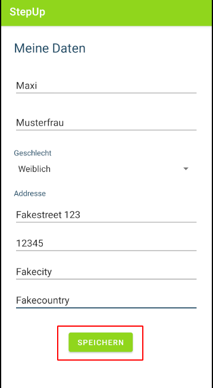
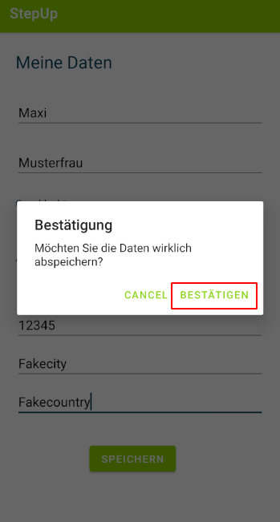
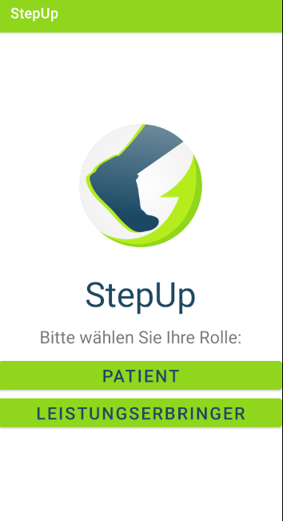

## Getting-Started

1. Bevor Sie mit der Nutzung der App starten können, müssen Sie einige Einstellungen vornehmen. Öffnen Sie die App und wählen Sie die Rolle "Patient" aus.

2. Öffnen Sie das Menü und klicken Sie auf "Servereinstellungen"

3. Geben Sie die URL zu einem FHIR Server und dem Backend an. Beachten Sie, dass sie eventuell eine Portnummer angeben müsssen. Außerdem sollte die URL mit "http://" oder "https://" anfangen. Zudem muss die URL mit einem "/" enden 

4. Speichern Sie die Eingabe mit dem Klick auf "Speichern" ab. Wenn alles erfolgreich war, wird eine Erfolgsmeldung erscheinen 

5. Navigieren Sie zurück zum Hauptmenü und öffnen Sie das Menü. Klicken Sie auf "Profil erstellen"

6. Nun öffnet sich die Benutzeroberfläche mit dem Sie ein neues Profil anlegen können. Geben Sie Ihre Daten ein

7. Speichern Sie Ihre Daten durch das Klicken auf den Button "Speichern" ab

8. Als nächstes wird ein Bestätigungsdialog angezeigt. Wenn Sie mit der Eingabe und der Übermittlung der Daten einverstanden sind, dann klicken Sie auf "Bestätigen"

9. Wenn alles erfolgreich abgeschlossen wurde, wird eine Erfolgsmeldung angezeigt

10. Navigieren Sie zurück zur Rollenauswahl

11. Nun ist die Konfiguration der App abgeschlossen. Sie können ab jetzt eine Rolle auswählen und die restliche Funktionalität nutzen!