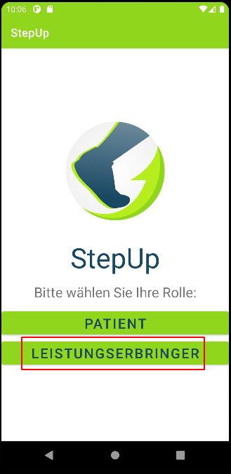
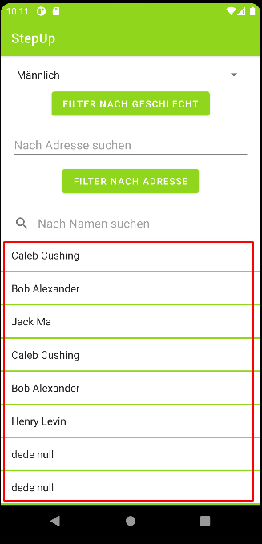
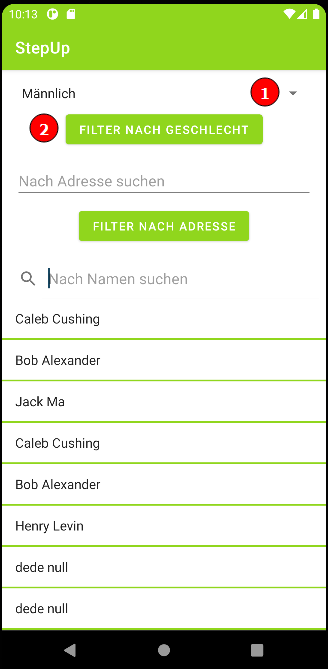
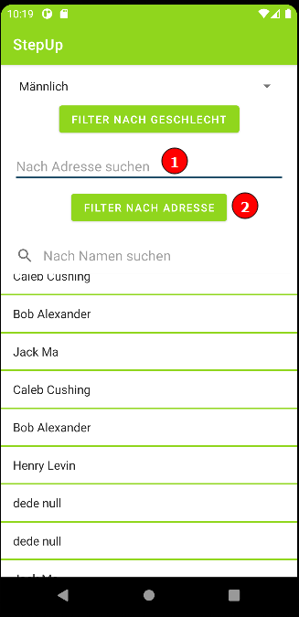
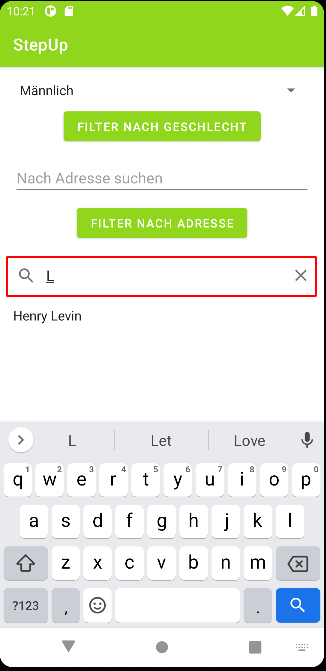
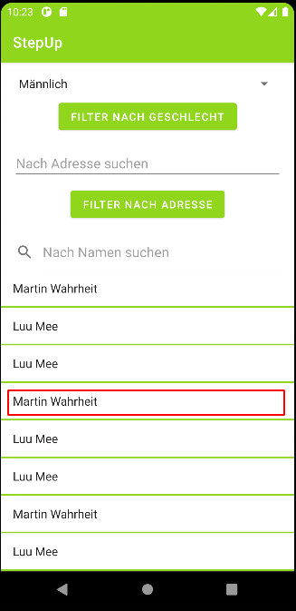
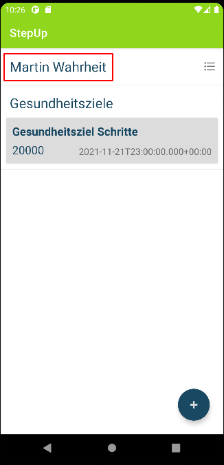

## Leistungserbringer Funktionalität

1. Im Rollenmenü die Option "Leistungserbringer" wählen

2. Warten bis die verfügbaren Patienten geladen wurden

3. Filterung anwenden (Es kann nur eine der beiden Optionen gleichzeitig genutzt werden!)

Option 1: Nach Geschlecht filtern: Gesuchtes geschlecht wählen (1) und "Filter nach Geschlecht" (2) drücken

Option 2: Nach Adresse filtern: Adressteil eingeben (1) und "Filter nach Adresse" (2) drücken

4. Filterung nach Namen (mit den vorigen Filtern kombinierbar): Namen oder Namensteile eingeben

5. Gewünschten Patienten auswählen

Von nun an besteht dieselbe Funktionalität wie als Patient. Folgende Aktionen bezüglich Gesundheitszielen und Beobachtungen werden auf den angezeigten Patienten durchgeführt.

