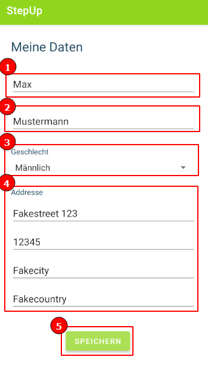

## Profil erstellen

1. Im Hautpmenü, öffnen Sie das Menü (1) und wählen Sie "Profil erstellen" aus (2)

2. Geben Sie Vorname (1), Nachname (2), Geschlecht (3) und Addresse (4) ein. Speichern Sie Ihre Eingabe mit mit einem Klick auf den "Speichern" Button (5)

3. Wenn Sie mit der Eingabe zufrieden sind, wählen Sie "Bestätigen"

4. Wenn alles Ihr Profil erfolgreich erstellt wurde, erhalten Sie eine Erfolgsmeldung

5. Gehen Sie zurück in die "Rollenauswahl"

6. Wenn Sie nun auf "Patient" klicken, gelangen Sie wieder in das Hauptmenü. Dort können Sie dann Ihr neues Profil mit Gesundheitszielen und Beobachtungen füllen

