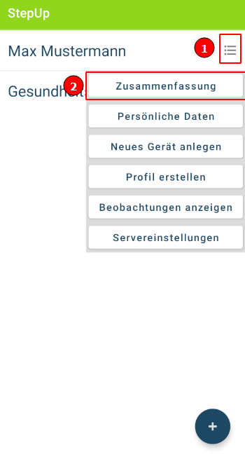
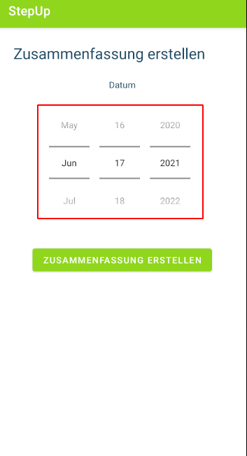
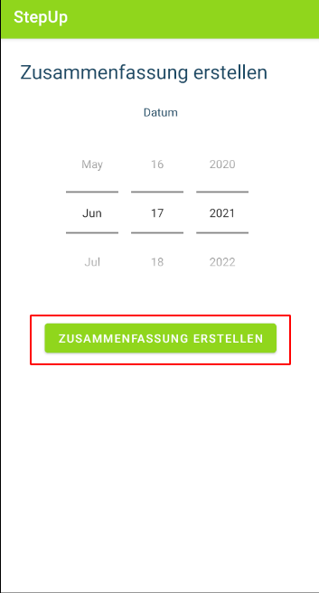
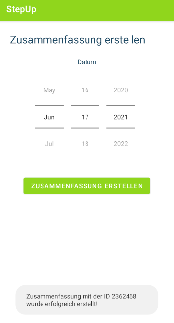

## Zusammenfassung erstellen

1. Im Hauptmenü die Option "Zusammenfassung" auswählen

2. Datum auswählen

3. "Zusammenfassung erstellen" Button drücken

4. Warten bis eine Erfolgsmeldung erscheint

